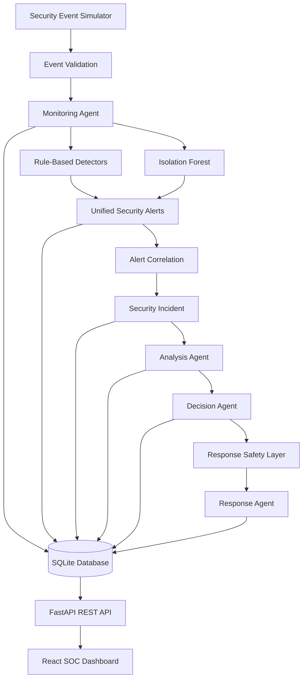

# AI-Powered Cyber Defense Simulator

A hybrid cybersecurity simulation platform that combines rule-based threat detection, Isolation Forest anomaly detection, multi-agent incident analysis, response-safety controls, persistent storage, a REST API, and a React security dashboard.

The project generates normal and malicious security activity, detects threats, correlates related alerts into incidents, evaluates their risk, selects defensive actions, and performs safe simulated responses.

> This is an educational and research-oriented simulation. It does not modify the real Windows firewall, terminate real processes, or operate directly on production network traffic.

## Features

- Dynamic normal and malicious event simulation
- Centralized security and simulation configuration
- Rule-based attack detection
- Isolation Forest anomaly detection
- Unified alert normalization
- Alert correlation and incident creation
- Multi-agent security architecture
- Risk and confidence analysis
- Policy-based response decisions
- Protected-target and approval safeguards
- Simulated automated containment
- SQLite persistence
- FastAPI REST backend
- React/Vite SOC dashboard
- System and response evaluation
- Event validation and failure isolation
- Reproducible simulations using random seeds
- Automated Python and frontend tests

## Supported Security Scenarios

| Scenario | Rule-Based Detection | AI Detection |
|---|---:|---:|
| Brute-force login | Yes | Possible |
| Distributed brute force | Yes | Yes |
| DDoS request flood | Yes | Yes |
| Port scan | Yes | Possible |
| Suspicious process activity | Yes | Possible |
| Low-and-slow credential attack | No | Yes |
| Distributed endpoint flood | No | Yes |
| Previously unseen unusual behaviour | No fixed signature | Possible |

Rule-based detection provides precise detection for known attack patterns. Isolation Forest detects event windows that differ from learned normal behaviour.

The hybrid approach allows rules and machine learning to support each other.

## System Architecture



## Multi-Agent Architecture

The security workflow is divided among specialized agents:

- **Monitoring Agent** — receives events and routes them to rule-based and AI detectors.
- **Analysis Agent** — evaluates correlated incidents, risk, severity, confidence, and supporting evidence.
- **Decision Agent** — selects the recommended defensive action using configured response policies.
- **Response Agent** — performs safe simulated actions and maintains response state.
- **Coordinator** — manages agent messages and the complete event-to-response workflow.

The agents are deterministic software agents. They do not currently depend on an external LLM.

## Detection Pipeline

```text
Security Event
    ↓
Event Validation
    ↓
Rule Detection + AI Window Analysis
    ↓
Normalized Alert
    ↓
Alert Correlation
    ↓
Security Incident
    ↓
Risk and Confidence Analysis
    ↓
Response Decision
    ↓
Safety and Approval Checks
    ↓
Simulated Defensive Action
```

## Defensive Actions

| Incident | Recommended action |
|---|---|
| Brute force | Block source IP |
| Distributed brute force | Block confirmed attacker IPs |
| DDoS | Rate-limit confirmed attacker IPs |
| Port scan | Block scanner IP |
| Suspicious process | Quarantine process |
| AI-only anomaly | Flag for investigation |
| Unknown incident | Continue monitoring |

AI-only alerts are not automatically treated as confirmed attacks. They are normally sent for investigation unless supported by stronger evidence.

## Response Safety

The response layer includes:

- Protected IP addresses and entities
- Confidence and risk thresholds
- Human-approval requirements
- Duplicate-action suppression
- Response cooldowns
- Temporary action expiry
- Reversal support
- Audit records
- Separation between incident evidence and confirmed response targets

Automatic containment uses targets supported by matching rule-based alerts. IP addresses that merely appeared in an anomalous AI window are retained as evidence but are not automatically blocked.

All containment actions are simulated.

## Technology Stack

### Backend and Detection

- Python 3.11
- scikit-learn
- Isolation Forest
- NumPy and SciPy
- Joblib
- SQLite
- FastAPI
- Uvicorn
- Pydantic

### Dashboard

- React
- Vite
- JavaScript
- CSS
- Vitest
- React Testing Library

### Development

- Git and GitHub
- Feature branches
- Pull requests
- Python `unittest`
- ESLint

## Project Structure

```text
AI-Cyber-Defense-Simulator/
├── agents/          Multi-agent workflow
├── alerting/        Alert schemas, normalization and correlation
├── backend/         FastAPI REST backend
├── config/          Central security configuration
├── dashboard/       React/Vite SOC dashboard
├── data/            Generated events and SQLite database
├── detector/        Rule-based and Isolation Forest detection
├── docs/            Project documentation
├── evaluation/      Detection and response evaluation
├── models/          Generated machine-learning model
├── monitor/         Event validation and pipeline entry point
├── simulator/       Normal and malicious event generation
├── storage/         SQLite persistence layer
├── tests/           Python automated tests
├── requirements.txt
└── README.md
```

## Installation

### 1. Clone the repository

```powershell
git clone https://github.com/vasanthvaka/AI-Cyber-Defense-Simulator.git
cd "AI-Cyber-Defense-Simulator"
```

### 2. Create a Python virtual environment

```powershell
python -m venv venv
```

Activate it:

```powershell
.\venv\Scripts\Activate.ps1
```

### 3. Install Python dependencies

```powershell
python -m pip install -r requirements.txt
```

### 4. Install dashboard dependencies

```powershell
cd dashboard
npm install
cd ..
```

## Generate Training Data and Train the Model

Training data and trained model files are generated locally and are intentionally excluded from Git.

Generate normal training activity:

```powershell
python -m simulator.generate_training_data
```

Train the Isolation Forest:

```powershell
python -m detector.train_anomaly_model
```

The trained model will be created at:

```text
models/isolation_forest.joblib
```

The model should be retrained whenever the AI feature schema or configured AI window size changes.

## Run the Simulator

### Demo Mode

Demo mode runs all major attack scenarios in a presentation-friendly order:

```powershell
python -m simulator.main --mode demo
```

Use a seed for reproducible output:

```powershell
python -m simulator.main --mode demo --seed 42
```

The same seed reproduces the same randomized attack structure.

### Live Mode

Live mode continuously mixes normal activity with dynamically selected attacks:

```powershell
python -m simulator.main --mode live
```

Stop live mode with:

```text
Ctrl+C
```

Live mode can also use a seed:

```powershell
python -m simulator.main --mode live --seed 99
```

## Run the Backend API

From the project root:

```powershell
uvicorn backend.api:app --reload
```

The API will be available at:

```text
http://127.0.0.1:8000
```

Interactive API documentation:

```text
http://127.0.0.1:8000/docs
```

The backend exposes data such as:

- Statistics
- Events
- Alerts
- Incidents
- Analyses
- Decisions
- Responses
- Audit records
- Individual incident details

## Run the Dashboard

Keep the backend running in one terminal.

Open another terminal:

```powershell
cd dashboard
npm run dev
```

Open the URL displayed by Vite, normally:

```text
http://127.0.0.1:5173
```

The dashboard retrieves security data from the FastAPI backend and refreshes it periodically.

A custom API URL can be configured using:

```text
VITE_API_URL
```

## Run the Tests

### Python Tests

From the project root:

```powershell
python -m unittest discover
```

Current verified suite:

```text
271 Python tests passing
```

### Dashboard Tests

```powershell
cd dashboard
npm test -- --run
```

Current verified suite:

```text
6 frontend tests passing
```

### Dashboard Linting

```powershell
npm run lint
```

### Production Build

```powershell
npm run build
```

## Run the Evaluations

### Detection Evaluation

```powershell
python -m evaluation.system_evaluator
```

### Response-Pipeline Evaluation

```powershell
python -m evaluation.response_evaluator
```

Evaluation reports are stored under:

```text
evaluation/results/
```

## Detection Evaluation Results

The final controlled simulation evaluated 700 windows across normal activity, known attacks, and threshold-evasion attacks.

| Method | Accuracy | Precision | Detection Rate | False Positive Rate | F1 Score |
|---|---:|---:|---:|---:|---:|
| Rule-based | 71.4% | 100.0% | 66.7% | 0.0% | 80.0% |
| Isolation Forest | 75.6% | 99.5% | 71.8% | 2.0% | 83.4% |
| Hybrid | 99.7% | 99.7% | 100.0% | 2.0% | 99.8% |

The rule-based system performed reliably on known attacks but missed scenarios designed to remain below fixed thresholds.

Isolation Forest detected the low-and-slow credential attack and distributed endpoint flood that the rules missed.

The hybrid system combined the precision of rules with the broader anomaly-detection capability of the AI model.

## Response Evaluation Results

| Metric | Result |
|---|---:|
| Attack response coverage | 100.0% |
| Correct workflow rate | 100.0% |
| Unsafe normal containment rate | 0.0% |
| Average pipeline latency | 30.426 ms |

These results were obtained in a controlled synthetic simulation and should not be interpreted as production network benchmarks.

## Central Configuration

Security thresholds and simulator behaviour are configured in:

```text
config/security_config.json
```

The configuration controls:

- Rule thresholds
- Detection time windows
- AI window size
- Normal activity ranges
- Attack intensity ranges
- Attack delays
- Live-mode attack probability

Centralized configuration allows system behaviour to be changed without modifying detection and simulation logic across multiple files.

## Generated Files

The following files are created locally and excluded from Git:

```text
data/security_events.jsonl
data/normal_training_events.jsonl
data/security_defense.db
models/isolation_forest.joblib
```

This prevents runtime data, generated models, and local databases from being committed accidentally.

## Event Validation and Reliability

Incoming events are validated before entering the agent pipeline.

Validation includes:

- Required fields
- Data types
- Timestamp format
- IP-address format
- Port ranges
- Login status
- Connection status
- Process identifiers

Malformed events are rejected safely.

Internal pipeline and AI-window errors are contained and reported without terminating the entire simulator.

## Current Status

The core system is complete and includes:

- Dynamic simulation
- Hybrid threat detection
- Incident correlation
- Multi-agent analysis
- Safe simulated responses
- Persistent storage
- REST API
- React dashboard
- Evaluation
- Automated testing
- System hardening

The remaining work is focused on final documentation, demonstration preparation, and release packaging.

## Limitations

- Events are simulated rather than collected from a real network.
- Defensive actions are simulated.
- Isolation Forest is trained using synthetic normal activity.
- Results depend on configured thresholds and generated scenarios.
- The current system is not intended for production deployment.
- AI anomaly detection identifies unusual behaviour but does not always determine the exact attack type.

## Future Enhancements

- Real network and operating-system telemetry
- Additional attack scenarios
- Supervised attack classification
- Online model retraining
- Model-drift monitoring
- Containerized deployment
- Authentication and role-based dashboard access
- Email or messaging notifications
- Threat-intelligence integration
- Optional LLM-generated incident explanations
- Production firewall and endpoint-response connectors with strict authorization controls